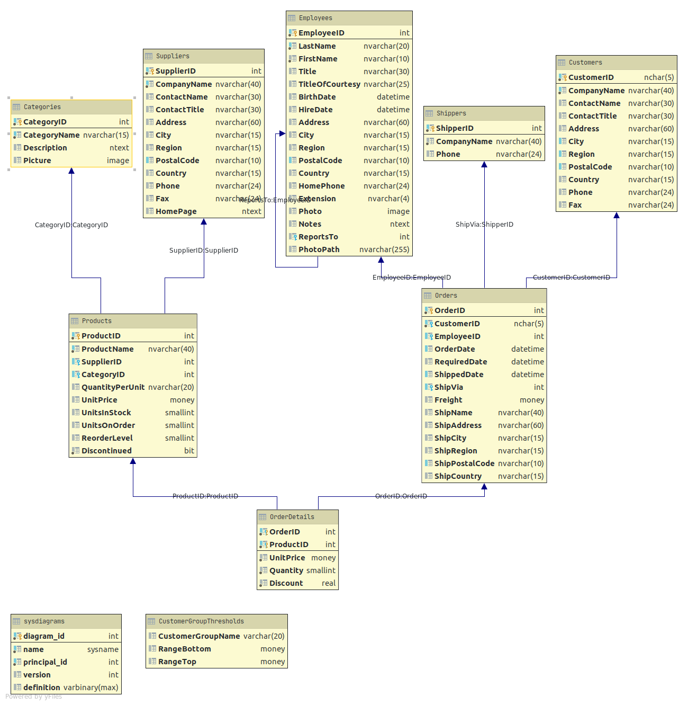

# Northwind database SQL problems

## Description

This file contains solutions to the book _SQL Practice Problem_ by Sylvia Moestl Vasilik.
There are 57 beginning, intermediate and advanced SQL challenges in total.
 
## DB Schema

## Technologies

 - Microsoft SQL Server
