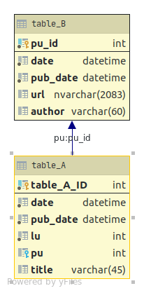

# Zadanie 2

## Opis

Napisz skrypt pokazujący liczbę UU (unique users) na poszczególnych materiałach za okres 1-25.10.2020. Chodzi tylko o materiały opublikowane w tym okresie. Na wyjściu- po wpisaniu skryptu - powinniśmy otrzymać dane w formie tabeli zawierające: tytuł, link do materiału, autora danej publikacji i liczbę UU. Materiały w tabeli powinny być uszeregowane malejąco według UU. 

Do dyspozycji masz tylko dwie tabele z następującymi polami (metrykami):)

    • Tabela A data - data w formacie RRRRMMDD (rok, miesiąc, dzień) pub_data - data publikacji w formacie RRRRMMDD lu - użytkownik pu - identyfikator danej publikacji title - tytuł publikacji
    
    • Tabela B data - data w formacie RRRRMMDD (rok, miesiąc, dzień) pub_data - data publikacji w formacie RRRRMMDD pu_id - identyfikator danej publikacji url - link do materiału author - autor danej publikacji
    
## DB Schema

## Technologies

Microsft SQL Server